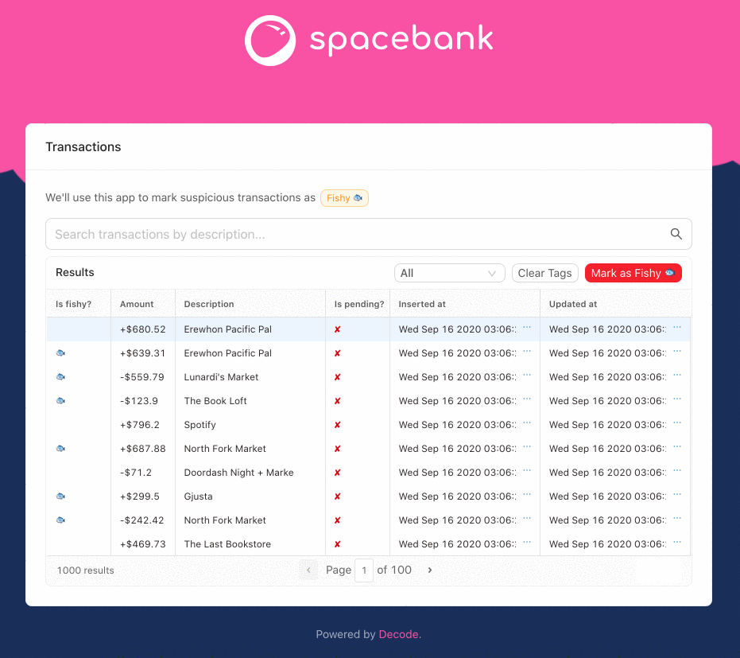
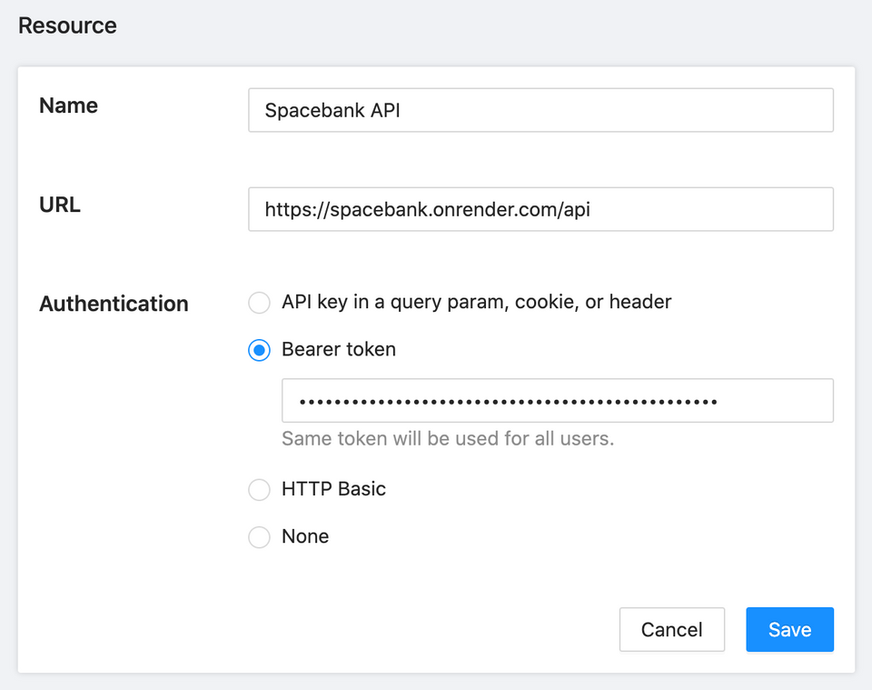
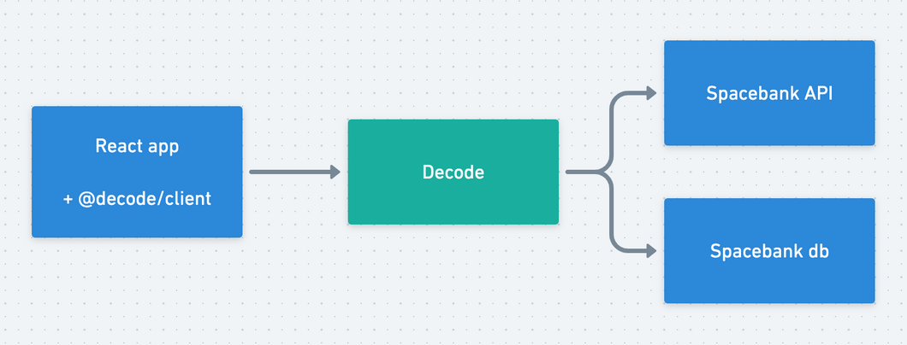

# Spacebank

## What is Decode?

Decode is a full-stack toolkit for developing internal tools in React. Internal tools are the stuff that employees at companies use, like customer support dashboards or ops tools.

<< TODO >>

## Overview

In this tutorial, we're going to build a tool for a bank, Spacebank. This tool is used by the bank's risk team to mark transactions as _fishy_ 🐟. Admins work through a table of transactions that they can sort and filter. They can mark a transaction as fishy/not fishy:

We'll make use of the following Decode features to bring this app to life:

- Zero-config authentication
- Direct database queries
- Decode hooks
- Decode components with built-in data fetching

<< TODO: Est time to complete >>

### Resources

Your Decode account comes pre-populated with two _resources_. In Decode, a resource can be either an HTTP API or a database (Postgres, MySQL, or MSSQL).

If you head over to the [Resources](https://dashboard.usedecode.com/resources) view, you'll see the two resources listed:

1. Spacebank API
2. Spacebank db

For this app, we'll use direct database queries for most of our reads. And we'll use the API for our writes (eg, marking a transaction as "Fishy").

This is common practice for internal tools. Composing database queries with Decode is fast and easy, and we can avoid needing to write bespoke endpoints to power this tool. For writes, often teams prefer using their API so they can run queries through application-level validation and ensure data integrity.

Click on the "Spacebank API" resource and you'll see how APIs are specified in Decode:

For APIs, we specify:

- The base URL of the API
- The security scheme Decode can use to connect to the API

Decode supports a variety of authentication schemes, but if you don't see your desired scheme listed just [let us know.](../contact)

Decode will use the same security scheme to call the API resource for every user. If you want to have user-dependent authentication, [we'd love to hear your use case](../contact).

As you can see if you click on the "Spacebank db," for databases you just specify the connection details.

In just a moment, we'll see how we use the Decode client library to securely route requests through Decode and to our two resources:

But first, we need to define our queries.

### Your first query

In Decode, a _query_ is how we fetch data from a resource. For HTTP APIs, a query is a request description, eg `GET /transactions`. For databases, a query is a SQL statement.

Head over to "Queries" and select "+ Add query"
