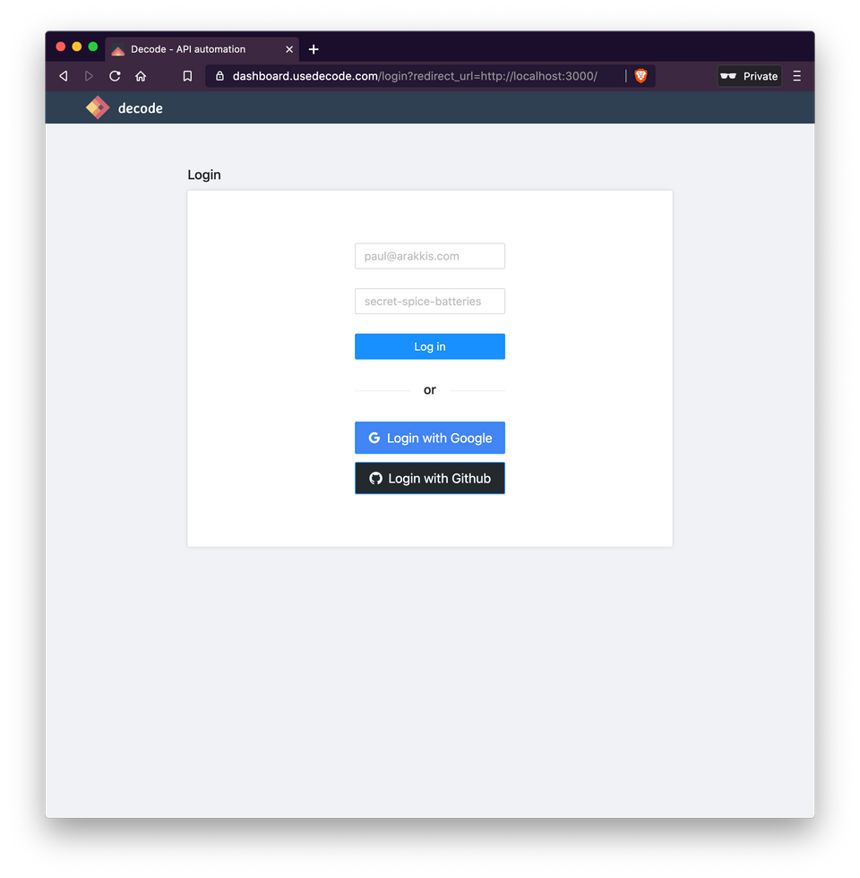
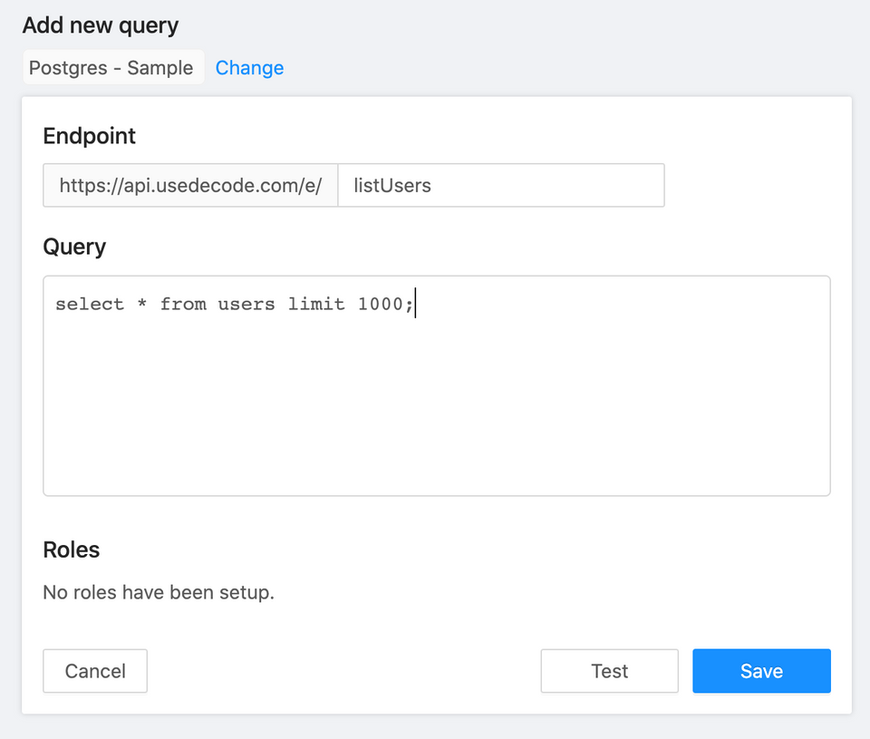

# Getting Started

> This tutorial assumes you have a React app already initialized and ready to add Decode to.<br><br>If you don't, we recommend using a tool like Create React App and a UI framework like Antd.

## Your first Decode fetch

Add the Decode npm library to your project:

```jsx
yarn add @decode/client@latest
```

To add login and token management to your app, all you need to do is wrap your top-level component with `DecodeProvider`, like this:

```jsx
import { DecodeProvider } from "@decode/client";

ReactDOM.render(
  <DecodeProvider>
    <App />
  </DecodeProvider>,
  document.getElementById("root")
);
```

When you save and reload your app, you should be redirected to the Decode login page:



Logging in and being redirected back to your app should just work. If it doesn't [please let us know](./contact)!

> Want to add users to your org for multiple login? Just [let us know](./contact)!<br><br>
> Branded login pages coming soon. If you want an early peek, let us know.

**Using `useDecode`**

Now that your app is wrapped in `DecodeProvider`, you can start pulling data from back-end services through Decode. `DecodeProvider` handles all token management with the Decode platform.

`useDecode` plugs in to `DecodeProvider` automatically. So, to pull data from Decode, you can use the hook like this:

```jsx
import { useDecode } from "@decode/client";

const App = () => {
  let { data, error } = useDecode("listUsers");

  if (error) return <div>failed to load</div>;
  if (!data) return <div>loading...</div>;

  return <div>Look at these {data.length} users!</div>;
};
```

**Adding the query to the Decode dashboard**

Last step is to add your query to Decode. Perhaps you want it to be a SQL query against a Postgres database, like this:



Under **Endpoint,** we specify the new API endpoint that will be created on Decode. Note we're using the same slug used in the front-end, `listUsers`. We don't need to worry about the rest of the URL because the client-side SDK resolves that for us.

When we click "Save," the endpoint will be instantly provisioned. If you refresh your React app, you'll see the data from your database populate your app!
