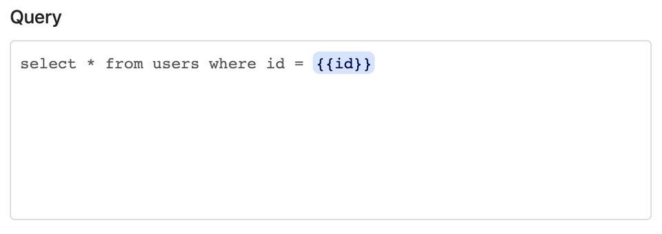
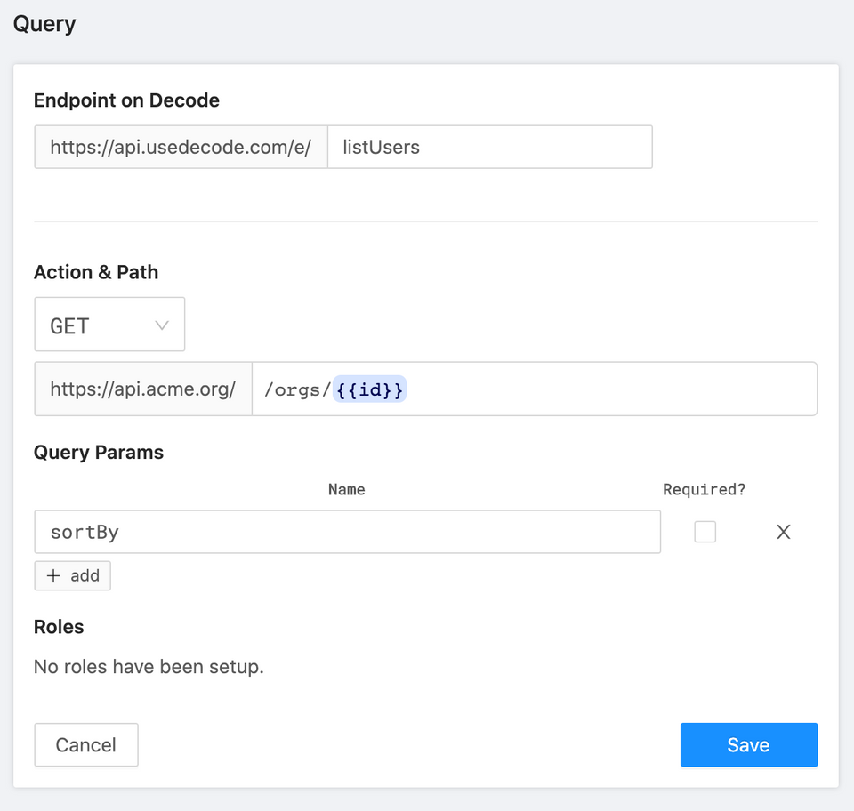
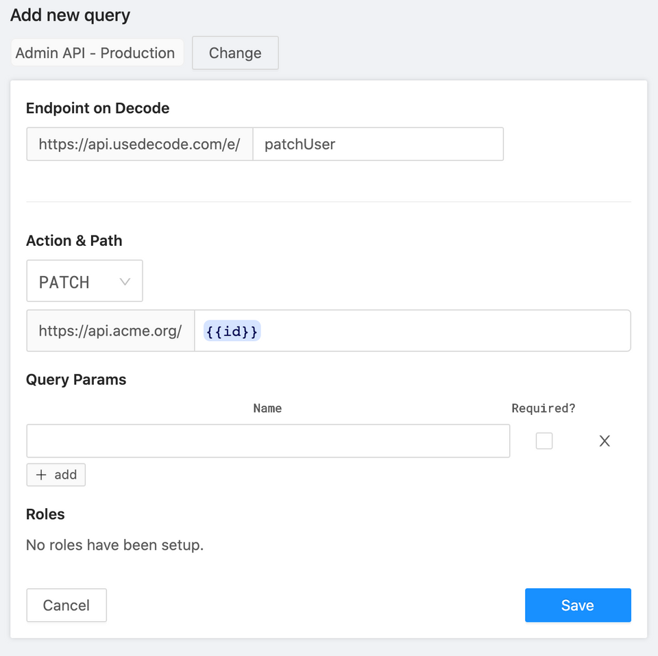

# Variables

You can use variables in both database and HTTP queries.

For example, here's a database query that contains an `id` variable in its statement:



And here's an HTTP query that contains an `id` variable in its path:


You specify variables by wrapping the variable in `{{}}`.

**Using variables in `useDecode`**

To call this endpoint from the front-end:

```jsx
function ShowUser({ id }) {
  let { data: user } = useDecode(["getUser", { id }]);

  // ...
}
```

You pass in an _array_ as the first argument. The first element is the slug, the second element is params for the request.

If you've used useSWR in the past, you might think you need to memoize `{ id }` . Not with `useDecode` - the library memoizes for you under the hood.

**Dependent variables**

Sometimes, one request might depend on the results of another, like this:

```jsx
function ShowUser({ id }) {
  let { data: user } = useDecode(["getUser", { id }]);
  // Error: will fail initially as `user` is not available
  let { data: companyOrders } = useDecode([
    "getCompanyOrders",
    { id: user.companyId },
  ]);

  // ...
}
```

Just pass a function to `useDecode` that returns the array instead. `useDecode` will invoke the function to derive the query parameters. If the function throws an error or returns `null`, Decode will assume it's because the query depends on another fetch. It will try again after "getUser" succeeds:

```jsx
function ShowUser({ id }) {
  let { data: user } = useDecode(["getUser", { id }]);
  let { data: companyOrders } = useDecode(() => [
    "getCompanyOrders",
    { id: user.companyId },
  ]);

  // ...
}
```

### HTTP requests

Let's say you have an HTTP request that looks like this:



Path and query param variables are passed in to `useDecode` as top-level properties in the params object, like this:

```jsx
function ShowOrgUsers({ orgId }) {
  let { data: users } = useDecode(["listUsers", { id: orgId, sortBy: "asc" }]);

  // ...
}
```

Often for write requests (i.e. POST/PUT/PATCH), you want to send along a body. Say you have an HTTP request that look like this:



Here's how you'd invoke the request:

```jsx
function EditUser({ id }) {
  let fetcher = useFetcher();

  let handleSubmit = ({ name, email }) => {
    fetcher("patchUser", { id, body: { name, email } });
  };
}
```

Decode will match `id` up with the required variable in the path. Everything under `body` will be forwarded along to the upstream API, like this:

```jsx
PATCH https://api.acme.org/1234
{
  name: "Gabe Goldman",
  email: "gabe@example.com"
}
```

Testing for HTTP queries on the Decode dashboard coming soon!
